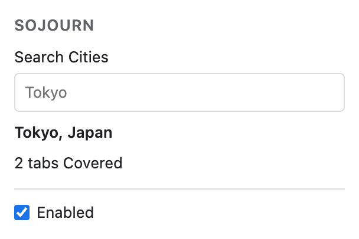

# Sojourn

Chrome extension that spoofs your time zone and geolocation to any city, with no trace a website can detect. Fixes the VPN time zone mismatch. Timezone spoofer and location spoofer built on the DevTools Protocol: no injected scripts, zero dependencies.



You pick a city in the popup. From then on every tab reports that city's IANA time zone through `Date`, `Intl` and `Temporal`, and coordinates near it through `navigator.geolocation`. Iframes, workers and service workers inside a covered page report the same values from their first line of script. Nothing else about your browser changes.

Version 0.1.1. Every automated check is green, and the thirteen checks a browser cannot be scripted into doing, in [scripts/manual-check.sh](scripts/manual-check.sh), passed in a real Chrome on 2026-09-15.

## Read this before you install

Three things are visible and permanent while Sojourn is on. None of them is a bug, and you should decide about them now rather than after the install.

**Chrome shows a bar that says "Sojourn" started debugging this browser.** It sits at the top of every tab in every window for as long as Sojourn is covering anything, and it has a Cancel button. Pressing Cancel switches coverage off everywhere; Sojourn's popup then offers Resume, which brings both back. The bar is the price of the mechanism below: there is no way to have the one without the other.

**Your new tab page becomes blank.** Sojourn replaces Chrome's new tab page with an empty page of its own, and Chrome will offer to change it back. Keep Sojourn's, because it is what makes a typed url safe: Chrome refuses to let any extension touch a tab showing its own new tab page, so a tab that starts there is already loading the site you typed before Sojourn can reach it. Out of Chrome's page, 20 loads in 20 leaked the real zone to the site's first script, which is the measurement [ADR-0003](docs/adr/0003-new-tab-page-override.md) records. Out of Sojourn's blank page, 0 in 20 did, and the Audit measures that again on every run. The omnibox still takes the caret, so typing a url works the way it did. An incognito window is the exception: Chrome lets no extension replace the new tab page there, Sojourn included, so an incognito new tab is Chrome's own and the first site you open from one reads your real zone in its first script.

Three things follow, and [docs/research/keeping-the-new-tab-page.md](docs/research/keeping-the-new-tab-page.md) has the source and the measurements behind each. The new tab page line on the install prompt is the price of covering that first script, and there is no version of Sojourn that keeps Chrome's page and closes the gap. On a machine managed by MDM or joined to a domain, the `NewTabPageLocation` policy overrides Sojourn's page and brings the gap back, and Sojourn cannot do anything about that. And neither a third-party search engine nor the `webNavigation` permission changes any of it.

**It does not hide your IP address.** A site that reads Tokyo from the browser and a European IP address from the connection has learned more about you than one that reads neither. Pair Sojourn with a VPN whose exit is in the same city, or do not use it.

## How it works

Sojourn attaches to each tab with Chrome's `chrome.debugger` API and sends two overrides, `Emulation.setTimezoneOverride` and `Emulation.setGeolocationOverride`, plus `Target.setAutoAttach` so that a frame or worker starting inside the tab is paused until it has the zone too. Chrome's own engine then produces the values.

That means there is nothing of Sojourn's in the page: no injected script, no added global, no element, no stylesheet, no console line, no readable resource, and no stack frame that names the extension. A script looking for the extension finds an unmodified browser.

The two permissions it asks for are `debugger` and `storage`. There are no host permissions, no content scripts, no web accessible resources, and one manifest key beyond the two permissions, the new tab page override above. It makes no network request from any context, ever, and stores nothing but your chosen city, the point generated for it, the on/off switch, and, until you close the browser, whether you dismissed the bar. A test asserts the permission list, and scans every TypeScript file under `src/`, which is all the shipped `dist/` is compiled from, together with the three files that ship beside it (`newtab.html`, `popup.html`, `popup.css`), for the name of a network API: `fetch`, `XMLHttpRequest`, `WebSocket`, `EventSource`, `sendBeacon`, `importScripts`. None of them appears anywhere.

The coordinates carry a small random offset generated once per install, up to 2 km from the city centre, so a list of known Sojourn coordinates cannot pick you out. They stay the same until you change city, including across browser restarts.

When a tab cannot be covered, the badge shows a red count and the popup names the reason. Sojourn never falls back to your real values quietly.

[ADR-0001](docs/adr/0001-override-mechanism.md) records why this mechanism and not page script patching, [ADR-0002](docs/adr/0002-no-other-surface.md) the boundary it refuses to cross, and [ADR-0003](docs/adr/0003-new-tab-page-override.md) the new tab page.

## Frequently asked

### Does this fix the VPN time zone mismatch?

Yes. Pick the city your VPN exits in and every tab reports that city's IANA time zone, so the clock the site reads and the country your IP address is in agree. It does not touch your IP address, so a city that does not match your exit leaves you easier to pick out, not harder.

### Can I fake my browser location in Chrome?

Yes. `navigator.geolocation` answers with coordinates near the city you picked, in the page and in every iframe, worker and service worker inside it, with a random offset of up to 2 km generated once per install so your point is not a known city centre. `test/e2e/geolocation.spec.ts` asserts what a covered page reads, field by field, against what the same page reads with no extension loaded.

### Why do other timezone spoofer extensions get detected?

Because they replace `Date`, `Intl` and the geolocation functions inside the page, and a replaced function looks replaced: `Function.prototype.toString`, property descriptors and stack frames all say so. Content scripts also never run in workers, so a service worker keeps answering with the real zone, which is the first place CreepJS looks. [docs/research/main-world-patching.md](docs/research/main-world-patching.md) catalogues fifty ways to see it, and [the Audit](#what-the-audit-proves-and-what-it-does-not) takes one probe for each of the fifty on every run, in ten contexts, against the same browser with no extension in it.

### Does it work in Brave or incognito?

It should work in any Chromium browser, because `chrome.debugger` and the two `Emulation` methods are Chromium's, not Chrome's. Nothing here has been tested on Brave, Edge, Arc or Opera: the harness runs Chromium and the manual checks ran in Chrome. Incognito works once you turn "Allow in Incognito" on, with one gap: Chrome lets no extension replace the new tab page in an incognito window, so the first site you open from a fresh incognito tab reads your real zone in its first script, which [docs/research/keeping-the-new-tab-page.md](docs/research/keeping-the-new-tab-page.md) reads out of Chromium's source.

### Why does Chrome show a debugging bar?

Because attaching `chrome.debugger` is what produces the override, and Chrome shows `"Sojourn" started debugging this browser` on every attach. That is the trade [ADR-0001](docs/adr/0001-override-mechanism.md) makes: the values come from Chrome's own engine, and the price is a bar you can see. Chrome's `--silent-debugger-extension-api` launch flag does suppress it, and the trade-off is a bad one: the flag is global, so it also hides the bar for every other extension that attaches a debugger, and that bar is the only notice you get that something is reading your pages.

### Why did my New Tab Page change?

Because Chrome refuses to let any extension touch a tab showing Chrome's own new tab page, so a site opened from one is already loading before Sojourn can reach it: 20 loads in 20 leaked the real zone to the site's first script out of Chrome's page, and 0 in 20 out of Sojourn's blank one. [ADR-0003](docs/adr/0003-new-tab-page-override.md) records the decision and that measurement.

## What it deliberately does not do

- **Your IP address, DNS and WebRTC.** Use a VPN. This is the one that matters.
- **`navigator.language` and `Accept-Language`.** A browser reporting Tokyo time and Dutch as its language is a browser with an extension in it. Sojourn still leaves the language alone, because changing it is a second guess about who you are and a second thing to get wrong.
- **The user agent, screen size, canvas, fonts and every other fingerprint surface.** Scope creep is how a privacy tool becomes a fingerprint.
- **Per-site rules, several cities at once, schedules, or picking the city from your VPN.** One city, everywhere, until you change it.
- **Firefox and Safari.**

## What the Audit proves, and what it does not

The Audit is a differential test. It loads a page that reads at least fifty probes in each of ten contexts, the page itself, four kinds of iframe, three kinds of worker, a service worker and a window the page opened, in a browser with Sojourn covering it and in the same browser without the extension loaded at all, and asserts that the only differences between the two reports are the time zone and the position. Fifty of those probes are the fifty detection vectors catalogued in [docs/research/main-world-patching.md](docs/research/main-world-patching.md), one probe each. A third run adds the case that matters most when you switch Sojourn off: the extension loaded and switched off has to be identical to a browser with no extension in it, and the Audit asserts that nothing at all moved. It all runs in `npm test`.

That is a real result rather than a claim, and it is bounded: it proves it for the probes it takes, in the contexts it can reach, on the machine it ran on. It cannot prove that no probe exists that it does not take. Everything below is a difference it does find, bounded and measured.

## Residual Traces

Every number here was measured on the machine that ran the phase it names, so expect it to drift by a few milliseconds from one machine to the next; the shape of each row is the claim, not its last digit.

| What a site could notice | How big | Measured by |
|---|---|---|
| Your real zone for up to a second, in a tab that shared a renderer process with a tab you just closed | under 1 s | `test/e2e/lifecycle.spec.ts`, "a Covered tab is handed its real zone for under a second when the owner of its renderer leaves" |
| The position's timestamp ages with the page instead of with the fix, where a real device's is always fresh | 5149 ms when first read, 8159 ms three seconds later, 35095 ms after 35 s, and back to a few ms after any navigation | the Audit's `position-timestamp-age-ms` for the first two, and the skipped `test/e2e/geolocation.spec.ts` case that names the third in its skip reason |
| One `POSITION_UNAVAILABLE` handed to an open `watchPosition` when you change city, before the new point arrives | one error, once per change, and only you can cause it | `test/e2e/geolocation.spec.ts`, "a watch hears the new City across a re-send, after the one error Chrome flushes first" |
| A `getCurrentPosition` made while that same page holds an open `watchPosition` ends in `TIMEOUT` rather than answering | every such call, measured at 2 s and at 40 s into a watch | the same watch test |
| The first script of a tab created straight onto a url, which is a bookmark or a link from another application, reads your real zone | 9 misses in 10. The window is about 25 ms wide: the same page served with 25 ms of latency misses none. A document already in the browser's cache misses 10 in 10 whatever the latency, because no request goes out to be beaten. Navigating a tab in the same millisecond it is created misses 6 in 10. Typing a url into a new tab, which is the common path, misses 0 in 20 | the Audit's `cached-document` and `cached-document-with-latency` on every run; the 9 in 10, the 25 ms and the 6 in 10 are phase measurements written down in [the brief](docs/plan/00-brief.md), and the test that would assert the first is skipped in `test/e2e/lifecycle.spec.ts` with its reason |
| A tab already sitting on the blank new tab page when Sojourn starts covering, which is a browser start or your first city, cannot be covered at all, and the first script of whatever it opens next reads your real zone | one document, once per such tab | `test/e2e/lifecycle.spec.ts`, "a tab already showing the New Tab Page when Sojourn starts covering is Restricted, and what it opens next misses" |
| Switching Sojourn off while a tab sits on the blank new tab page leaves that one tab covered for one more document | one document, then the real zone within a second | `test/e2e/lifecycle.spec.ts`, "Disabling reaches a tab on the New Tab Page only once that tab goes somewhere" |
| In an incognito window the new tab page is Chrome's own, because no extension may replace it there, so the first site you open from a fresh incognito tab reads your real zone, from its first script until Sojourn's next pass reaches the tab | one document, and about half a second to a second of it, once per such tab and only in incognito | read out of Chromium's source in [docs/research/keeping-the-new-tab-page.md](docs/research/keeping-the-new-tab-page.md), which measured Chrome's own new tab page at 0 covered in 10 outside incognito; the harness cannot open an incognito window, so stage 10 of [scripts/manual-check.sh](scripts/manual-check.sh) is where a human sees it |
| The debugging bar takes height off every window, which a page can see as `resize` events and a shorter `innerHeight` | `innerHeight` 714 before the bar and 658 after, a delta of 56 px, over 6 to 8 `resize` events | the Audit's `bar`, measured in a headed browser |
| The first position answers instantly, where a browser with a real location provider takes hundreds of milliseconds to get a fix | 0 ms, rounded to the nearest 50 | the Audit's `first-position-ms` |
| A cross-origin iframe and a worker start a few milliseconds later, because each is held until it has the zone | iframe `load` at a median of 8.5 to 9.1 ms against 6.8 to 9.0 without Sojourn, worker first message at 2.6 to 4.7 against 2.2 to 2.8 | the Audit's `pause-latency`, medians over five runs, three repeats |
| A window a page opens for itself can read your real zone in its first script, which is a race rather than a gap | 0 misses in 5 same-site and 0 in 5 cross-site, with one repeat out of three reading 1 miss in 5 cross-site | the Audit's `first-script-gaps` |

## Install

Chrome cannot install a zip directly, so both paths end at Load unpacked.

**From the release:** download `sojourn-0.1.1.zip` from [the latest release](https://github.com/elrazez/sojourn-timezone-location-spoofer/releases/latest), unzip it somewhere you will keep it, open `chrome://extensions`, turn Developer mode on, click "Load unpacked" and choose the unzipped folder.

**From this repository:** run `npm install && npm run build`, then load the `extension/` folder the same way. `npm run package` builds the same `sojourn-<version>.zip` the release carries.

Chrome will say the extension changed the page shown on new tabs, and offer to change it back. Keep Sojourn's page; the reason is above.

**Incognito** is off by default for every extension. To cover private windows, open `chrome://extensions`, click Details on Sojourn, and turn "Allow in Incognito" on. Incognito tabs are then covered exactly like normal ones, and the badge counts them together.

## Using it

- Click the icon to open the popup: a search box over more than 150 cities, the switch, and what is covered right now.
- The badge is empty when every web tab is covered, reads `OFF` when the switch is off or the bar was cancelled, and shows a red count of tabs that should be covered and are not.
- Browser pages and the Chrome Web Store are counted apart and never on the badge, because no extension may touch them. Another extension's own page is the exception: Chrome refuses it with the same sentence it uses for an ordinary web page that merely embeds an extension's iframe, so Sojourn shows it in red rather than risk dropping a real page off the badge.
- Changing city takes effect in open tabs within a second, with no reload. A `Date` made before the change keeps its instant and re-renders in the new zone, which is what a laptop crossing a border does.

## Development

Node 22 or newer, which `package.json` declares. The extension's manifest sets its runtime floor at Chrome 125, the first version whose debugger API reports the child sessions it needs.

```
npm install
npm test            # typecheck, the pure modules under Vitest, then Playwright with the extension loaded
npm run build       # compiles src/ into extension/dist/
npm run package     # builds, then zips extension/ into sojourn-<version>.zip
```

TypeScript, strict, compiled by `tsc` to ESM. No bundler, and no runtime dependencies at all. Playwright drives a real Chromium with the extension loaded and serves test pages from two origins Chrome treats as separate sites, so cross-process frames are real.

## The manual checks

Some of this cannot be scripted: the debugging bar has no API, a service worker cannot be stopped from inside itself, prerendering never happens under the harness, and discarding a tab closes the harness's own connection to the browser. [scripts/manual-check.sh](scripts/manual-check.sh) walks a human through the thirteen checks that are left, one screen at a time, and lists at the end anything that failed.

```
./scripts/manual-check.sh
```

It builds the extension, serves its own check page from your machine, and tells you exactly what to click. It asks for no secret and writes nothing but that build. One stage offers to open a third-party check page, which is the only thing in the run that leaves your machine, and you can decline it.

## Documents

- [CONTEXT.md](CONTEXT.md): the glossary. Every word above with a specific meaning is defined there.
- [docs/plan/00-brief.md](docs/plan/00-brief.md): the product brief, which is the specification the whole build is reviewed against.
- [docs/adr/](docs/adr/): the three decisions that are hard to reverse.
- [docs/research/](docs/research/): what Chrome actually does, cited to its source.
- [docs/plan/](docs/plan/): the build, one prompt per phase.
- [CLAUDE.md](CLAUDE.md): the rules agents work under in this repository.

## License

MIT. See [LICENSE](LICENSE).
